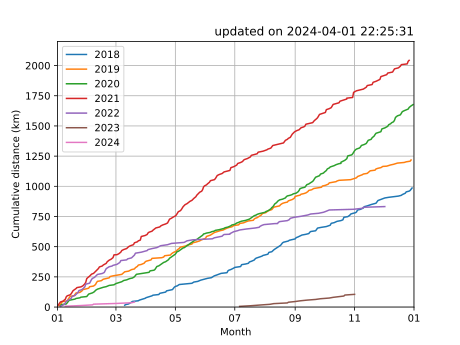

# jog_data
Data of jogging

## 2019/ ; folder for CY2019
- 2019.csv ; jogging data of CY2019 by WristableGPS
- graph_2019_01.py ; draw graph
- 2019.svg ; graph

## data/ ; jogging Data
- total_data.csv ; total Data

## cum_distance/ ; draw graphs of cumulative distance
- cum_distance.py ; draw graphs
- cum_distance.svg ; graphs (not satisfied :-p)
- cum_distance2.py ; draw graphs of cumulative distance in one figure
- cum_distance2.svg ; graph in one figure (good! :-)
- cum_distance3.py ; function is same as that of cum_distance2.py. but, we need not care the change of year
- cum_distance3.svg ; output of cum_distance3.py

